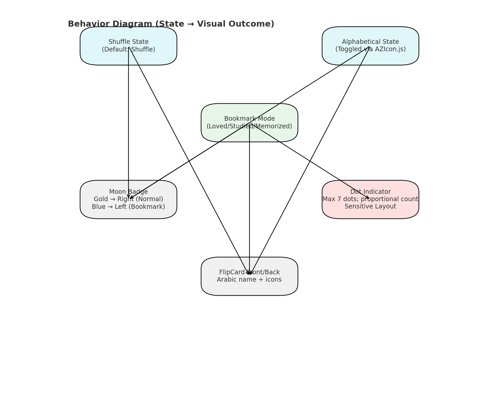

# Flipping99 – 99 Names of Allah Flashcards

[](LICENSE)

> Flipping99 is a React Native (Expo) app for memorizing the 99 Names of Allah using interactive flip cards, shuffle mode, and a unique dual bookmarking system with dedicated study/memorization decks.

---

## Overview

- **Problem**: Physical flashcards for the 99 Names of Allah were cumbersome and hard to manage.  
- **Solution**: A mobile-first digital experience with flip cards, shuffle toggle, and categorized bookmarking (study + memorized) — including a manual organization folder to track real progress.  
- **Outcome**: Published to the Google Play Store with custom domain, privacy policy, and scalable architecture.

---

## Features

- **Flip cards**: Tap to reveal meaning/description.  
- **Shuffle / alphabetical toggle**: Switch study modes easily.  
- **Dual bookmarking system**: Combines quick visual marking with dedicated study/memorized decks.
  - **Gold icons (left)** = Visual bookmarks for quick marking.  
  - **Blue icons (right)** = Dedicated categories (📖 Studying, 🧠 Memorized).  
  - **Organization folder**: Manually remove studied/memorized cards from main deck count (e.g., 99 → 85).  
- **Counters**: Live “X of 99” display for studying/memorized sets.  
- **Offline-first**: Uses local JSON + AsyncStorage for persistence.

---

## Screenshots

<!-- Placeholder for core screens -->
- Home Screen (Default deck)  
- Flip Animation (Arabic → Meaning)  
- Bookmark System (Gold/Blue icons)  
- Organization Folder (Manual adjust)  

  
  
  
  

---

## Architecture

### Folder Structure

```text
project-root/
├── App.js                # Entry point
├── assets/data/99names.json
├── components/FlipCard.jsx
├── components/DotIndicator.jsx
├── components/MoonBadge.jsx
├── hooks/useBookmarks.js
├── screens/HomeScreen.jsx
└── utils/shuffle-names.js
```
### Diagrams

  


---

## Tech Stack

- **React Native + Expo** – cross-platform development  
- **AsyncStorage** – persistent bookmark storage  
- **react-native-card-flip** – card flip animations  
- **react-native-svg** – custom moon badge graphics  
- **npm-shrinkwrap.json** – exact dependency locking

---

## Installation

```bash
git clone <repo-url>
cd ninety-nine-names-native
npm ci --legacy-peer-deps
npx expo start --tunnel
```
- Scan QR with **Expo Go** or press `w` for web preview.

---

## Development Notes

- `npm-shrinkwrap.json` ensures exact dependency versions.
- `package-lock.json` intentionally ignored for consistency.
- Use `npm ci` instead of `npm install` for deterministic builds.

---

## Roadmap

- **Auto-adjust mode**: Deck updates dynamically as bookmarks change (no manual folder toggle).  
- **Enhanced analytics**: Study streaks, memorization progress charts.  
- **Vertical swipe shuffle**: Reintroduce for alternative study flow.  
- **Cloud sync**: Save bookmarks to Firebase/Supabase for cross-device use.

---

## License

MIT License © 2025 Adam Makhyoun  
*Attribution appreciated; forks and learning encouraged.*
