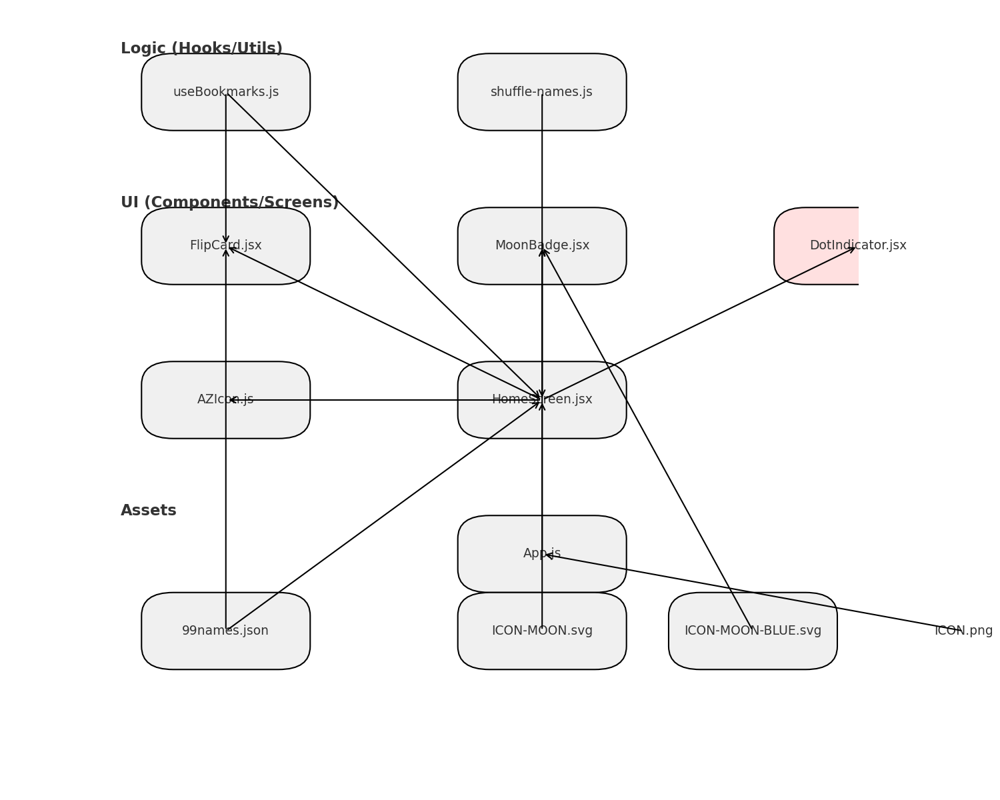
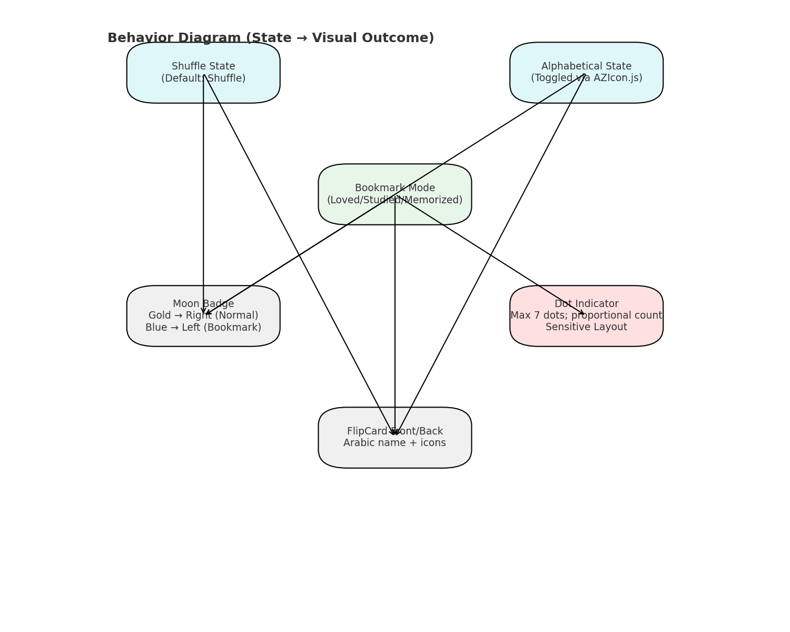

# 99 Names of Allah Flipcard App – Technical Summary

## Overview
This React Native + Expo application presents the 99 Names of Allah in a flipcard interface with shuffle and bookmark functionality. Users can toggle between shuffle and alphabetical order, and filter names by bookmark categories (loved, studied, memorized). Persistent storage is handled via AsyncStorage.

---

## Project Structure

```
project-root/
│
├── App.js                 # Entry point; loads names and bookmarks, passes props to HomeScreen
│
├── assets/
│   ├── data/99names.json  # Static data source for all names (id, name, transliteration, title, description, verse, reference)
│   ├── ICON-MOON.svg      # Gold moon (default)
│   ├── ICON-MOON-BLUE.svg # Blue moon (bookmark mode)
│   └── ICON.png           # App icon
│
├── components/
│   ├── FlipCard.jsx       # Displays front/back of cards; bookmark icons; integrates MoonBadge
│   ├── DotIndicator.jsx   # Page indicator (max 7 dots; proportional scaling) **Sensitive**
│   ├── MoonBadge.jsx      # Badge (gold/blue) with dynamic position
│   ├── AZIcon.js          # Toggle button for shuffle/alphabetical mode
│   └── hooks/
│       └── useBookmarks.js # Bookmark logic (AsyncStorage persistence)
│
├── screens/
│   └── HomeScreen.jsx     # Main UI; FlatList navigation, shuffle toggle, bookmark filtering, counter display
│
└── utils/
    └── shuffle-names.js   # Shuffle logic for name order
```

---

## Diagrams

### Structure Diagram


### Behavior Diagram


---

## Data Flow

- **99names.json → HomeScreen**: Loaded into state and shuffled via `shuffle-names.js`.
- **HomeScreen → FlipCard**: Passes each name’s data + bookmark state (loved, studied, memorized).
- **FlipCard → MoonBadge / DotIndicator**: Renders badge color/position and indicator dots based on active category & card index.
- **useBookmarks.js → HomeScreen/FlipCard**: Manages persistent bookmark state across sessions.

---

## Key Behaviors

### Shuffle / Alphabetical Toggle
- Controlled by `AZIcon.js` via `HomeScreen` state.
- Shuffle mode is default; alphabetical mode resets index to 0.

### Bookmark Categories
- **Loved, Studied, Memorized** (heart, book, brain icons).
- Filtered view when category active.
- Memorized mode shows counter: “X of 99 Memorized”.

### Dot Indicator (Sensitive)
- Max 7 dots; proportional to card count.
- Must preserve proportional logic during UI changes.

### Moon Badge
- **Gold, right-aligned** (normal mode).
- **Blue, left-aligned** (bookmark mode).

---

## Extension Points (Safe)
- **UI Polishing**: Card styling, icon size, typography (safe; isolated in `FlipCard` styles).
- **New Bookmark Categories**: Extend `useBookmarks.js` and update icon logic in `FlipCard` + `HomeScreen`.
- **Animations**: Can add to FlipCard or MoonBadge without affecting DotIndicator logic.

**Caution**: Avoid altering `DotIndicator.jsx` logic unless explicitly needed (layout sensitive).

---

## Dependencies
- `react-native-card-flip` for flip animations.
- `react-native-svg` for moon badge.
- `@react-native-async-storage/async-storage` for persistent bookmarks.
- `expo` for project scaffolding and build tools.

---

## Next Steps
- UI/UX polish (spacing, fonts, icon clarity).
- Optional: add search/filter by name.
- Optional: audio pronunciation support.
